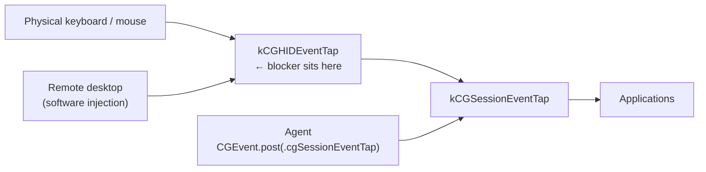

# agent-curtain

**Draw the curtain; the show goes on behind it.**

A "fake lock screen" for macOS: blank every display and swallow physical
keyboard/mouse input, while keeping the login session **unlocked** so GUI
agents keep working — and while letting whitelisted remote-desktop tools
through, identified by process ID.

[中文版](README.zh-CN.md) · [Measurements](docs/FINDINGS.md)


```
curtain on      # all displays dark, physical input dead, agents unaffected
curtain off     # draw it back
curtain status
```

---

## 1. Background

GUI agents — Claude Computer Use, OpenAI Codex Computer Use, and similar
tools — drive a Mac the way a person does: they screenshot the display,
then post synthetic mouse and keyboard events. This makes them uniquely
capable (they reach native apps and GUI-only tools that have no API) and
uniquely fragile: they need a live, rendering, unlocked desktop.

That fragility is invisible on a laptop you carry around. It becomes the
central constraint on an **always-on workstation** — a machine that sits in
an office running unattended agent work for hours.

## 2. Problem

An always-on machine in a shared space has two requirements that, on macOS
today, are mutually exclusive:

| Requirement | Mechanism | Effect on GUI agents |
|---|---|---|
| Nobody who walks in can see or use it | Screen lock | **Agents stop entirely** |
| Agents keep working unattended | No lock | **Desktop fully exposed** |

Neither half is optional, and macOS offers no middle ground. Locking is not
a matter of degree — the moment `CGSSessionScreenIsLocked` flips, the window
server stops compositing for the session and every screenshot-driven agent
goes blind.

## 3. Existing approaches, and why they fail

### 3.1 Vendor lock-screen support

**OpenAI Codex "Locked use"** installs an authorization plug-in that
participates in the macOS unlock flow, temporarily unlocking for an active
Computer Use turn while covering all displays. The design is sound. In
practice we measured a **plug-in cold-start race**: after the screen locks,
`SecurityAgentHelper` needs time to load the plug-in, but Computer Use's
post-submission validation window is roughly 2 s. The plug-in finished
creating ~0.34 s too late and the attempt received `DENY`; the retry
overlapped the previous authorization chain and exhausted the allowance.

**Anthropic Claude Computer Use** does not attempt this. The documentation
is explicit: *"your computer needs to be awake and the Claude Desktop app
needs to be open."*

### 3.2 Overlay / privacy-shield apps

Several apps paint a full-screen passcode overlay while leaving the session
unlocked. This preserves the *session*, but not the *agent*: since macOS 15,
`ScreenCaptureKit` ignores `NSWindow.sharingType = .none`, so the overlay is
captured too. The agent sees the passcode screen instead of the app it is
supposed to drive. Overlays trade the same capability that locking does,
while providing strictly weaker security.

### 3.3 Display sleep

`pmset displaysleepnow` blanks every panel and looks like an elegant answer.
It is not: display sleep stops the window server from compositing. Measured
screenshots during display sleep came back at **0.0/255** (pure black), and
on some displays `screencapture` failed outright.

## 4. Contribution

`agent-curtain` occupies the gap all three approaches leave open:

- **Blank** every display via DDC brightness, which does **not** touch the
  framebuffer — agents keep seeing real content.
- **Swallow** physical keyboard and mouse input at the HID event tap, a
  layer that agent-injected events never traverse.
- **Pass through** remote-desktop tools by process ID, so the operator
  retains remote control while a bystander cannot type.
- Keep the session **unlocked** throughout, so GUI agents are untouched.

## 5. Technical approach

### 5.1 Event layering

macOS delivers physical input at `kCGHIDEventTap`. Agents post synthetic
events with `CGEvent.post(tap: .cgSessionEventTap)`, which enters
*downstream* of the HID tap.



A tap installed at the HID layer therefore cannot see — and cannot block —
agent input. This is the property the whole design rests on, and it is
measured rather than assumed (§6.1).

### 5.2 Identifying the injector

Remote-desktop tools inject in software but still traverse the HID layer.
Their events carry the injecting process in
`CGEventField.eventSourceUnixProcessID`; genuine hardware events report `0`.
The blocker reads this field and consults an allowlist resolved from
executable paths (refreshed periodically, so a restarted process keeps
working).

### 5.3 Denylist: designing around an unmeasurable

"Allow everything with `pid != 0`" would remove configuration entirely. It
carries one risk: a keyboard-enhancement tool (Karabiner-Elements) grabs the
physical keyboard and re-emits events through its own virtual HID device. If
those re-emitted events carried a non-zero PID, physical input would be
allowed wholesale and the blocker would be defeated.

Rather than determine which is true, `agent-curtain` uses a **denylist** that
overrides everything else and ships with Karabiner's components in it:

| If re-emitted events | Denylist effect |
|---|---|
| carry a non-zero PID | blocks them; physical input stays blocked |
| are `pid = 0` | harmless no-op; they were already blocked |

**Safe under both.** The unmeasurable quantity never has to be measured.

### 5.4 TCC responsibility

Creating an event tap needs Accessibility permission, and macOS attributes
it to the **responsible process**, not the binary:

| Launch path | Responsible process | `curtain on` |
|---|---|---|
| Authorized interactive shell | that shell | ✅ |
| SSH (direct fork) | `sshd` | ❌ |
| launchd | the binary itself (needs its own grant) | ✅ * |
| AppleScript applet | the applet | ❌ |

\* Deliberately not used. Making SSH arming work requires granting
Accessibility to a binary that can swallow all physical input, and lets
anyone with SSH arm it. `agent-curtain` forks directly instead, so only an
already-authorized interactive terminal can arm.

**`curtain off` needs no permission at all** — it sends `SIGTERM` and
restores brightness. That asymmetry is the guarantee that you can never lock
yourself out.

The cost of attributing to the caller is that arming depends on the caller's
permission state, which is not stable. **Arm from Terminal.app, never from an
agent session** (Claude Code, Codex, and friends): their responsible bundle is
a per-version helper under `~/Library/Application Support/`, and an auto-update
deletes the old version directory, so a *running* session loses every TCC
capability at once — Accessibility, Screen Recording, Documents, Full Disk
Access — while the grants themselves stay intact in `TCC.db`. See
[FINDINGS §9](docs/FINDINGS.md) for the 2026-09-02 incident.

`curtain on` preflights this before dimming and prints the responsibility
chain when it fails; `curtain doctor` reports it up front.

Granting `hid-blocker` itself is a separate trap: a path-type entry added in
System Settings pins a **cdhash**, not a Developer ID requirement. Change the
binary and the entry silently stops matching — and unchecking/rechecking the
box does *not* refresh it; you must remove the row and add it back. `doctor`
prints both hashes when they diverge.

## 6. Evaluation

Measured on MacBook Pro 18,4 / macOS 26.5.2 / four displays. Full data and
method in [docs/FINDINGS.md](docs/FINDINGS.md).

### 6.1 Layer separation

Listen-only taps at both layers; one synthetic event injected into each:

| Injected into | Observed at HID | Observed at session |
|---|---|---|
| `.cgSessionEventTap` | 0 | 1 |
| `.cghidEventTap` | 1 | 1 |

Session-injected events do not reach the HID layer.

### 6.2 Blocking is selective

Same two injections, with the blocker active:

| | HID tap | Session tap |
|---|---|---|
| Baseline | 1 | **2** |
| Blocking | 1 | **1** |

The missing event is the HID-injected one. The session-injected one passed
through untouched.

### 6.3 Remote desktop passes through

PID attribution over a 45 s window of real remote-desktop use:

```
RESULT total=679
  pid=58218  n=679  UURemoteServer
```

All 679 events attributed. During a subsequent real session with the
allowlist active:

```
RELEASED (SIGTERM) blocked=0 allowed=1936
```

### 6.4 Blanking preserves capture

| Method | Panels | `screencapture` |
|---|---|---|
| Baseline | lit | 241.2 / 255 |
| DDC brightness → 0 | dark | **222.6 / 255** (real content) |
| `pmset displaysleepnow` | dark | **0.0 / 255**, some displays fail |

### 6.5 Banner rendering

Verified by scanning all four framebuffers for the banner's signature color
— roughly 4,900 matching pixels per display. The banner is invisible to
someone standing at the machine (panels are dark) but visible over remote
desktop (which reads the framebuffer).

## 7. Discussion

### 7.1 Security model

`agent-curtain` is **weaker than a real lock screen**, by construction. The
session stays unlocked; anyone who can bypass input blocking — plug in a new
keyboard, reboot, pull the disk — reaches the desktop.

It defends against **opportunistic access**: a colleague walking past, a
visitor in the room. It does not defend against a prepared attacker. Use it
with FileVault, and do not use it to protect high-value data. When nobody is
around *and* no GUI agent work is pending, a real lock screen remains the
better choice.

### 7.2 What is still unverified

**The core behavior — that physical input is actually blocked — has not been
verified with a real keypress.** Every measurement above used programmatic
injection; the `blocked` counter has never been incremented by a human at
the keyboard. The layering evidence is strong and the denylist covers the
known bypass, but treat this as an open item until you confirm it on your
own machine.

The release hotkey is unverified for the same reason: programmatically
synthesized keyboard events do not reach the HID layer, so it cannot be
tested automatically.

### 7.3 Portability

Developed and measured on a single Apple Silicon machine running macOS
26.5.2. The event-layering behavior is a documented Core Graphics property
and should hold broadly; the TCC responsibility matrix and DDC quirks are
more likely to vary.

DDC control uses BetterDisplay because `m1ddc` could not write to the
built-in display or a DELL U3219Q. Displays must be addressed by
`-displayID`: `name` collided across two identical monitors, and
`originalName` did not match the built-in display.

---

## Installation

```bash
git clone https://github.com/longbiaochen/agent-curtain.git
cd agent-curtain && ./install.sh
```

Requirements: macOS, Xcode Command Line Tools, [BetterDisplay](https://betterdisplay.pro/)
(`brew install --cask betterdisplay`), optionally Karabiner-Elements for hotkeys.

Arm from an interactive terminal that already holds Accessibility permission
(Terminal.app, or a terminal opened inside a remote-desktop session) — not from
an agent session; see §5.4.

`install.sh` also loads `curtain-sentry`, a read-only LaunchAgent that checks
every 5 minutes for "you asked for the curtain, it isn't there" and alerts.
It never arms the curtain by itself.

## Configuration

- `~/.config/curtain/allowlist` — executable paths whose events pass through
- `~/.config/curtain/denylist` — always blocked, overrides everything
- `~/.config/curtain/sentry.conf` — `CURTAIN_ALERT_CMD` receives the alert on
  stdin. A local notification is useless when you are away, so point this at
  something that reaches your phone:
  `CURTAIN_ALERT_CMD="curl -s -d @- https://ntfy.sh/<your-topic>"`

Agent events travel the session layer and never reach the HID tap, so they
do **not** need to be listed.

## License

MIT
