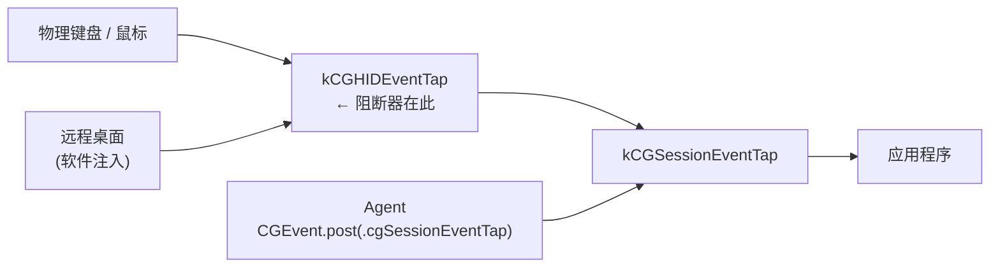

# agent-curtain

**拉上幕帘,后台照常演出。**

macOS 上的「假锁屏」:熄灭全部显示器、吞掉物理键鼠输入,但保持登录会话
**解锁**,让 GUI agent 继续工作;同时按进程 ID 精确放行远程桌面工具。

[English](README.md) · [实测数据](docs/FINDINGS.md)


```
curtain on      # 四块屏全黑,物理键鼠失效,agent 照常
curtain off     # 拉开
curtain status
```

---

## 1. 背景

GUI agent —— Claude Computer Use、OpenAI Codex Computer Use 及同类工具 ——
以人的方式驱动 Mac:截取屏幕,再注入合成的鼠标键盘事件。这让它们拥有独特
能力(能够到没有 API 的原生应用和纯 GUI 工具),也带来独特的脆弱:它们需要
一个**活着的、正在渲染的、未锁定的**桌面。

这个脆弱在随身笔记本上不显眼。但在**常驻工作站**上——一台放在办公室、
连续数小时跑无人值守 agent 任务的机器——它变成了核心约束。

## 2. 问题

共享空间里的常驻机器有两个需求,而在当前的 macOS 上二者互斥:

| 需求 | 手段 | 对 GUI agent 的影响 |
|---|---|---|
| 进来的人看不到也用不了 | 锁屏 | **agent 完全停摆** |
| agent 无人值守继续干活 | 不锁屏 | **桌面完全暴露** |

两者都不可放弃,而 macOS 没有中间地带。锁屏不是程度问题——
`CGSSessionScreenIsLocked` 一翻转,窗口服务器就停止为该会话合成,
所有靠截图工作的 agent 立刻失明。

## 3. 已有方案,以及它们为何不成立

### 3.1 厂商的锁屏支持

**OpenAI Codex「Locked use」** 安装一个参与 macOS 解锁流程的授权插件,
在活跃的 Computer Use turn 期间临时解锁,同时遮盖所有显示器。设计是合理的。
但实测存在**插件冷启动竞态**:锁屏后 `SecurityAgentHelper` 需要时间加载插件,
而 Computer Use 的提交后验证窗口约 2 秒。插件晚约 0.34 秒才创建完成,
该次尝试收到 `DENY`;重试又与前一条授权链重叠,耗尽额度。

**Anthropic Claude Computer Use** 没有尝试这件事。文档写得很明确:
*"your computer needs to be awake and the Claude Desktop app needs to be open."*

### 3.2 遮罩类隐私应用

有若干应用会画一层全屏密码遮罩,同时保持会话解锁。它保住了**会话**,
却保不住 **agent**:自 macOS 15 起,`ScreenCaptureKit` 忽略
`NSWindow.sharingType = .none`,遮罩本身会被拍进截图。agent 看到的是密码框,
而不是它该操作的应用。遮罩付出了和锁屏一样的代价,安全性却严格更弱。

### 3.3 显示器休眠

`pmset displaysleepnow` 能熄灭所有面板,看上去是个优雅答案。并不是:
display sleep 会让窗口服务器停止合成。实测该状态下的截图返回
**0.0/255**(纯黑),部分显示器上 `screencapture` 直接失败。

## 4. 本项目解决了什么

`agent-curtain` 填的正是上述三条都留下的空隙:

- 用 DDC **调暗**每块显示器,该操作**不触及** framebuffer —— agent 仍看到真实画面
- 在 HID 事件层**吞掉**物理键鼠输入,而 agent 注入的事件从不经过这一层
- 按进程 ID **放行**远程桌面工具,操作者保留远程控制,旁人却敲不动
- 全程保持会话**解锁**,GUI agent 不受任何影响

## 5. 技术点

### 5.1 事件分层

macOS 在 `kCGHIDEventTap` 投递物理输入。agent 用
`CGEvent.post(tap: .cgSessionEventTap)` 注入合成事件,进入点在 HID 层**下游**。



因此挂在 HID 层的 tap **看不见**、也**挡不住** agent 的输入。整个设计立在
这条性质上,而它是实测出来的,不是假设的(见 §6.1)。

### 5.2 识别注入者

远程桌面工具在软件层注入,但仍经过 HID 层。它们的事件在
`CGEventField.eventSourceUnixProcessID` 里带着注入进程;真实硬件事件此值为 `0`。
阻断器读取该字段,对照由可执行文件路径解析出的白名单(定期刷新,
所以进程重启换了 PID 依然有效)。

### 5.3 拒绝名单:为无法测量的量做设计

「放行一切 `pid != 0`」可以完全免去配置,但有一个风险:键盘增强工具
(Karabiner-Elements)抓取物理键盘后,经自身虚拟 HID 设备重新发出事件。
若这些重发事件带非零 PID,物理输入会被整体放行,阻断器失效。

`agent-curtain` 不去判定究竟是哪一种,而是用一份**优先级最高的拒绝名单**,
默认收录 Karabiner 的组件:

| 若重发事件 | 拒绝名单的作用 |
|---|---|
| 带非零 PID | 拦下,物理输入仍被阻断 |
| 为 `pid = 0` | 无害空操作,本来就会被拦 |

**两种情况下都安全。**那个无法测量的量,自始至终不需要被测量。

### 5.4 TCC 归责

创建事件 tap 需要辅助功能权限,而 macOS 按**责任进程**归责,不是按二进制:

| 启动路径 | 责任进程 | `curtain on` |
|---|---|---|
| 已授权的交互式 shell | 该 shell | ✅ |
| SSH(直接 fork) | `sshd` | ❌ |
| launchd | 二进制自身(需其自有授权) | ✅ * |
| AppleScript applet | applet 自身 | ❌ |

\* **刻意不用。**让 SSH 启用生效,需要给一个能吞掉全部物理输入的二进制授予
辅助功能权限,且任何能 SSH 进来的人都能启用它。`agent-curtain` 改为直接
fork,因此只有已授权的交互式终端能启用。

**`curtain off` 完全不需要权限** —— 它只是发 `SIGTERM` 并恢复亮度。
这个不对称正是「永远不会把自己锁在外面」的保证。

归责到调用方的代价是:能不能启用,取决于调用方此刻的授权状态,而那不稳定。
**从 Terminal.app 启用,不要从 agent 会话启用**(Claude Code、Codex 等):
它们的责任 bundle 是 `~/Library/Application Support/` 下随版本变化的 helper,
自动升级会删掉旧版本目录,于是**正在运行**的会话瞬间失去全部 TCC 能力 ——
辅助功能、屏幕录制、文稿文件夹、完全磁盘访问 —— 而 `TCC.db` 里的授权本身
一条没少。2026-09-02 的事故复盘见 [FINDINGS §9](docs/FINDINGS.md)。

`curtain on` 现在会在调暗**之前**做这项预检,失败时打印归责链;
`curtain doctor` 也会直接报出来。

给 `hid-blocker` 自身授权是另一个坑:在系统设置里按路径添加的条目,
`csreq` 钉的是 **cdhash**,不是 Developer ID 的 identifier+anchor。
二进制一变条目就静默失配,而且取消勾选再勾上**不会**刷新 ——
必须删掉整条再加回。失配时 `doctor` 会把新旧 cdhash 并排打出来。

## 6. 实验效果

测量环境:MacBook Pro 18,4 / macOS 26.5.2 / 四显示器。
完整数据与方法见 [docs/FINDINGS.md](docs/FINDINGS.md)。

### 6.1 分层隔离

在两层各挂一个只监听的 tap,分别向两层各注入一个合成事件:

| 注入目标 | HID 层观察到 | session 层观察到 |
|---|---|---|
| `.cgSessionEventTap` | 0 | 1 |
| `.cghidEventTap` | 1 | 1 |

session 层注入的事件不到达 HID 层。

### 6.2 阻断是有选择的

同样两次注入,阻断器生效时:

| | HID tap | session tap |
|---|---|---|
| 基线 | 1 | **2** |
| 阻断中 | 1 | **1** |

少掉的那个正是 HID 层注入的事件。session 层注入的原样穿过。

### 6.3 远程桌面可穿透

45 秒真实远程桌面操作窗口内的 PID 归属:

```
RESULT total=679
  pid=58218  n=679  UURemoteServer
```

679 个事件全部归属明确。随后一次白名单生效的真实使用:

```
RELEASED (SIGTERM) blocked=0 allowed=1936
```

### 6.4 熄屏不影响画面捕获

| 手段 | 面板 | `screencapture` |
|---|---|---|
| 基线 | 亮 | 241.2 / 255 |
| DDC 亮度归零 | 黑 | **222.6 / 255**(真实内容) |
| `pmset displaysleepnow` | 黑 | **0.0 / 255**,部分显示器直接失败 |

### 6.5 提示条渲染

通过扫描四块 framebuffer 中提示条的特征色验证 —— 每块约 4,900 个匹配像素。
站在机器前的人看不到它(面板是黑的),但通过远程桌面能看到(远程读的是 framebuffer)。

## 7. 讨论

### 7.1 安全模型

`agent-curtain` 在设计上就**弱于真锁屏**。会话保持解锁,任何能绕过输入阻断
的人——插一个新键盘、重启、把硬盘拆走——都能到达桌面。

它防的是**机会型接触**:路过的同事、进屋的访客。它防不住有准备的攻击者。
请与 FileVault 配合使用,不要用它保护高价值数据。当四下无人**且**没有待跑的
GUI agent 任务时,真锁屏仍是更好的选择。

### 7.2 仍未验证的部分

**核心行为——物理输入确实被阻断——尚未用真实按键验证过。**
上述所有测量都使用程序化注入,`blocked` 计数从未由真人按键产生。
分层证据是充分的,拒绝名单也覆盖了已知的绕过路径,但在你自己的机器上
确认之前,请把它当作未决项。

解除热键因同样的原因未经验证:程序化合成的键盘事件到不了 HID 层,
无法自动化测试。

### 7.3 可移植性

仅在一台 Apple Silicon 机器、macOS 26.5.2 上开发与测量。事件分层行为是
Core Graphics 的既有性质,应当普遍成立;TCC 归责矩阵与 DDC 的各种怪癖
则更可能因机器而异。

DDC 控制使用 BetterDisplay,因为 `m1ddc` 无法写入内置显示器和 DELL U3219Q。
显示器必须用 `-displayID` 定址:`name` 在两块同型号显示器上冲突,
而 `originalName` 匹配不上内置显示器。

---

## 安装

```bash
git clone https://github.com/longbiaochen/agent-curtain.git
cd agent-curtain && ./install.sh
```

依赖:macOS、Xcode Command Line Tools、[BetterDisplay](https://betterdisplay.pro/)
(`brew install --cask betterdisplay`),可选 Karabiner-Elements 用于热键。

请从**已持有辅助功能权限的交互式终端**启用(Terminal.app,或在远程桌面里
打开的终端),不要从 agent 会话启用 —— 原因见 5.4。

`install.sh` 同时会加载 `curtain-sentry`:一个只读的 LaunchAgent,
每 5 分钟检查一次「你要求拉上、但幕帘不在」并告警。它自己**不会**启用幕帘。

## 配置

- `~/.config/curtain/allowlist` —— 其事件被放行的可执行文件路径
- `~/.config/curtain/denylist` —— 永远拦下,优先级高于一切
- `~/.config/curtain/sentry.conf` —— `CURTAIN_ALERT_CMD` 从 stdin 收到告警文本。
  人不在本机时本机通知没用,把它接到能推到手机的东西上:
  `CURTAIN_ALERT_CMD="curl -s -d @- https://ntfy.sh/<你的主题>"`

agent 的事件走 session 层、从不到达 HID tap,因此**无需**列入。

## License

MIT
